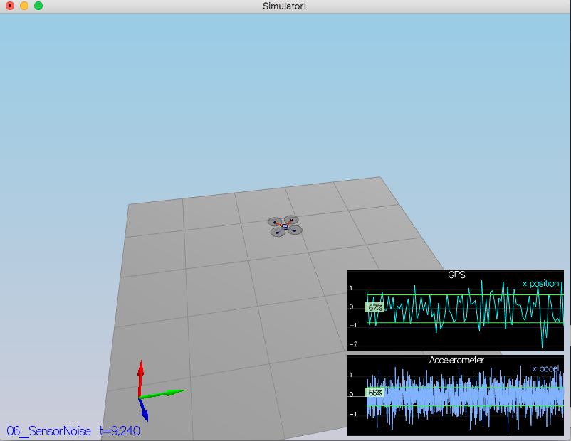
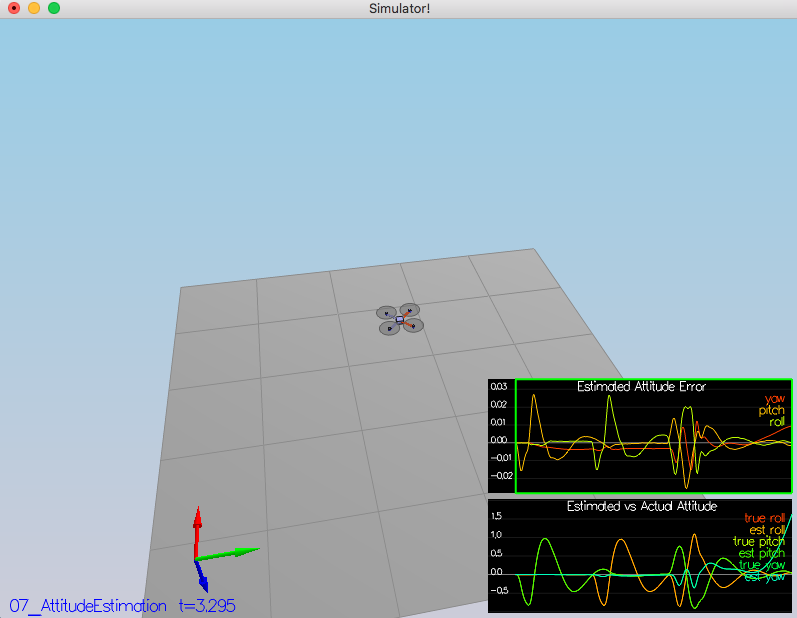
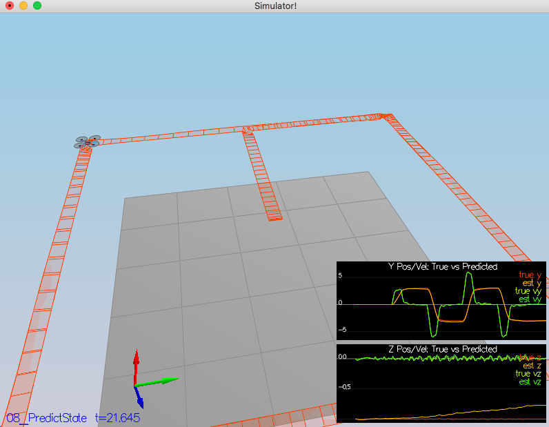
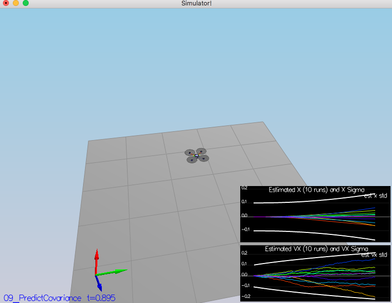
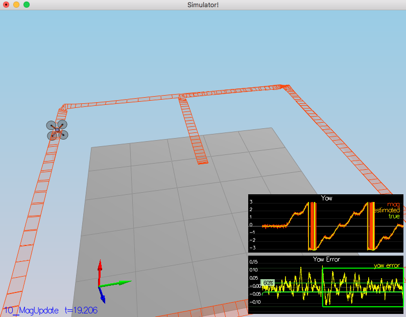
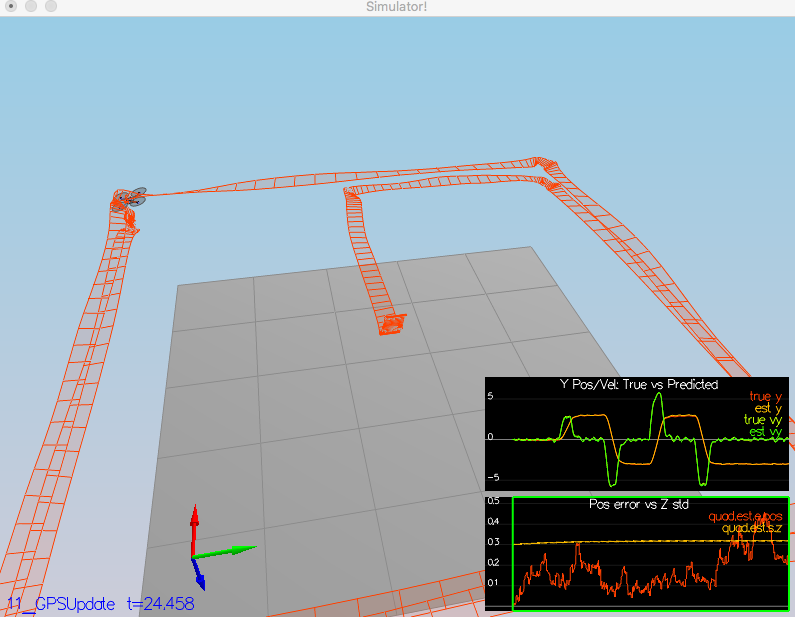

# FCND-Term1-P4-Estimation
Udacity Flying Car Nanodegree - Term 1 - Project 4 - Estimation

The goal of this project is to develop an estimator which will be used in the controller for successfully flying by desired path using real and noisy sensors.

# Scenarios

The project consists of six scenarios where most of the missing parts of the EKF needs to be implemented and tested.

## Scenario 1: Sensor noise
The simulator will generate two log files with GPS and IMU measurements. The task is to process data from these files and calculate the standard deviation(sigma).
It is a pretty straightforward task where I used Numpy function [numpy.std](https://docs.scipy.org/doc/numpy/reference/generated/numpy.std.html)


Scenario passed the test, below the standard output:
```
PASS: ABS(Quad.GPS.X-Quad.Pos.X) was less than MeasuredStdDev_GPSPosXY for 69% of the time
PASS: ABS(Quad.IMU.AX-0.000000) was less than MeasuredStdDev_AccelXY for 66% of the time
```

## Scenario 2: Attitude Estimation
In this scenario need to include IMU measurements to the result state. This is require to implement a better integration method that uses the current attitude estimate (rollEst, pitchEst and ekfState(6)) to integrate the body rates into new Euler angles. I've used class `Quaternion<float>` with handy methods `FromEuler123_RPY` and `IntegrateBodyRate`.

```
PASS: ABS(Quad.Est.E.MaxEuler) was less than 0.100000 for at least 3.000000 seconds
```

## Scenario 3: Prediction Step
The task consist of two parts: implement the prediction step for the EKF and update the covariance matrix and finish the EKF state using the equations provided [by Udacity](https://www.overleaf.com/read/vymfngphcccj#/54894644/) . The important section is 7.2 Transition Model.
Below the screenshot after implementing the first part


Here is a result screenshot after tuning `QPosXYStd`, `QVelXYStd` process parameters in QuadEstimatorEKF.txt
We can see how sigma growing over time due to the prediction step.


## Scenario 4: Magnetometer Update
Now we need to use the magnetometer to improve our filter's performance in estimating the vehicle's heading. 
To implement the update, we need to use the equations from section `7.3.2 Magnetometer` from the [Estimation for Quadrotors](https://www.overleaf.com/read/vymfngphcccj#/54894644/) paper.

```
PASS: ABS(Quad.Est.E.Yaw) was less than 0.120000 for at least 10.000000 seconds
PASS: ABS(Quad.Est.E.Yaw-0.000000) was less than Quad.Est.S.Yaw for 60% of the time
```

## Scenario 5: Closed Loop + GPS Update
Actually, after this task we will get the working estimator. To achieve that need implement method `UpdateFromGPS` (very simple implementation). After that commenting control params `#SimIMU.AccelStd = 0,0,0 #SimIMU.GyroStd = 0,0,0` in the file `config/11_GPSUpdate.txt`
```
PASS: ABS(Quad.Est.E.Pos) was less than 1.000000 for at least 20.000000 seconds
```

## Scenario 6: Adding Your Controller
And now we can merge the controller from the previous project and run with the our estimator. My version was quite stable and I not spend extra time on tuning the controller again.

```
PASS: ABS(Quad.Est.E.Pos) was less than 1.000000 for at least 20.000000 seconds
```


